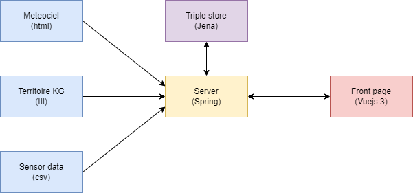

<!--
_header: ""
_footer: ""
_paginate: false
_class: "centerer"
-->

# Semantic web presentation

_Antoine Willerval and Yassine Bouziane_

---

# Project objectives

Make a Web application that integrates data from multiple sources.

Define a knowledge model.

Usage of a triple store with the usage of queries.

---

# Web application architecture

---

# Data sources

Territoire Knowledge graph ([https://territoire.emse.fr/kg/](https://territoire.emse.fr/kg/))

Meteo Ciel ([https://www.meteociel.fr/](https://www.meteociel.fr/temps-reel/obs_villes.php?code2=7475))

Sensor Data ([https://emse.fr](https://emse.fr/~zimmermann/Teaching/SemWeb/Project/))

---

## Territoire Knowledge graph (KG)

✔️

Already in a triple form, easy to add to the triple store

---

## Sensor Data

✔️

Raw data with simple format (CSV)

❌

Had to convert it to triple form to be added to the triple store

---

## Meteo Ciel

❌

No raw data now

❌

Had to parse it to get raw data (can break if they decide to change the format!)

❌

Had to convert it to triple form to be added to the triple store

---

---
